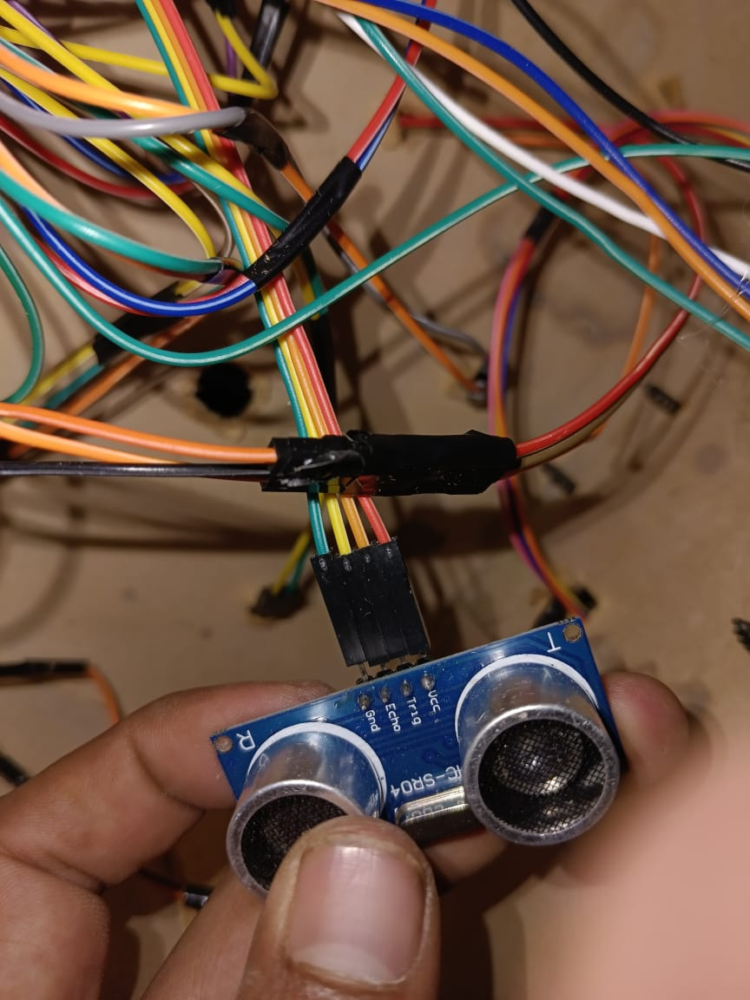
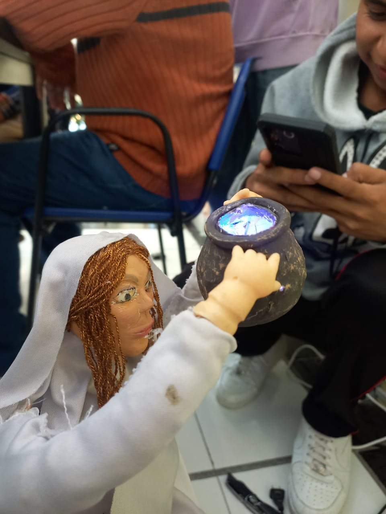
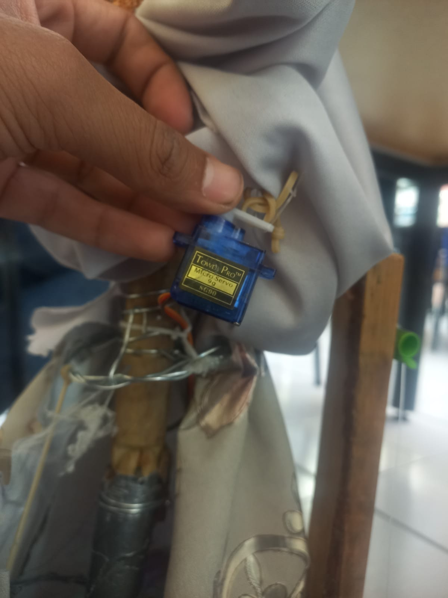
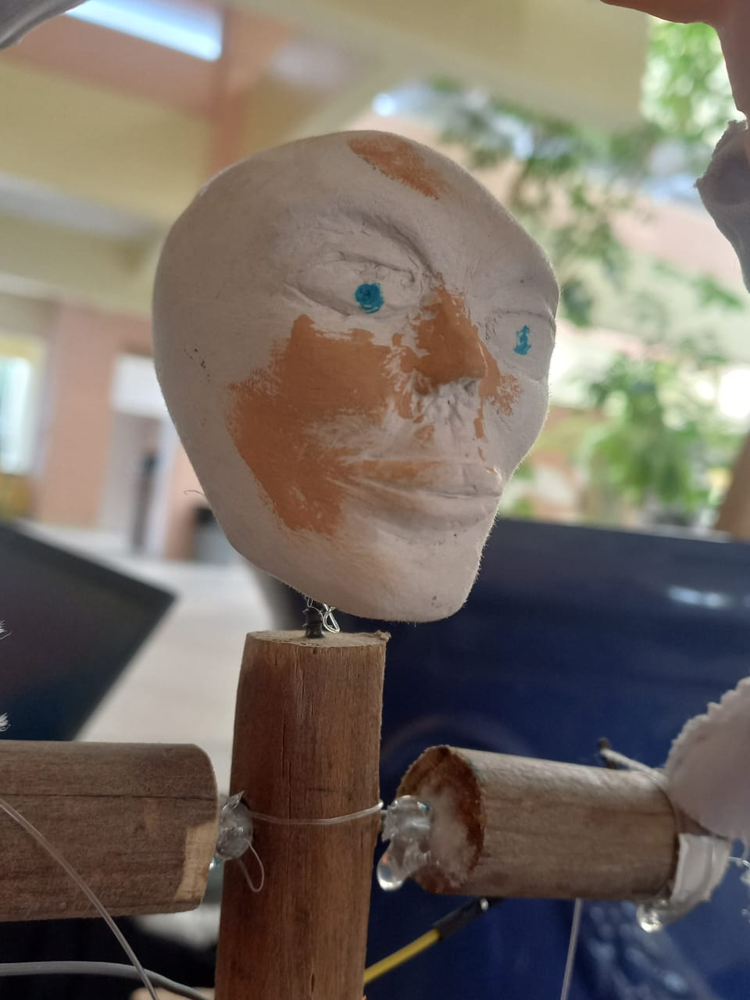
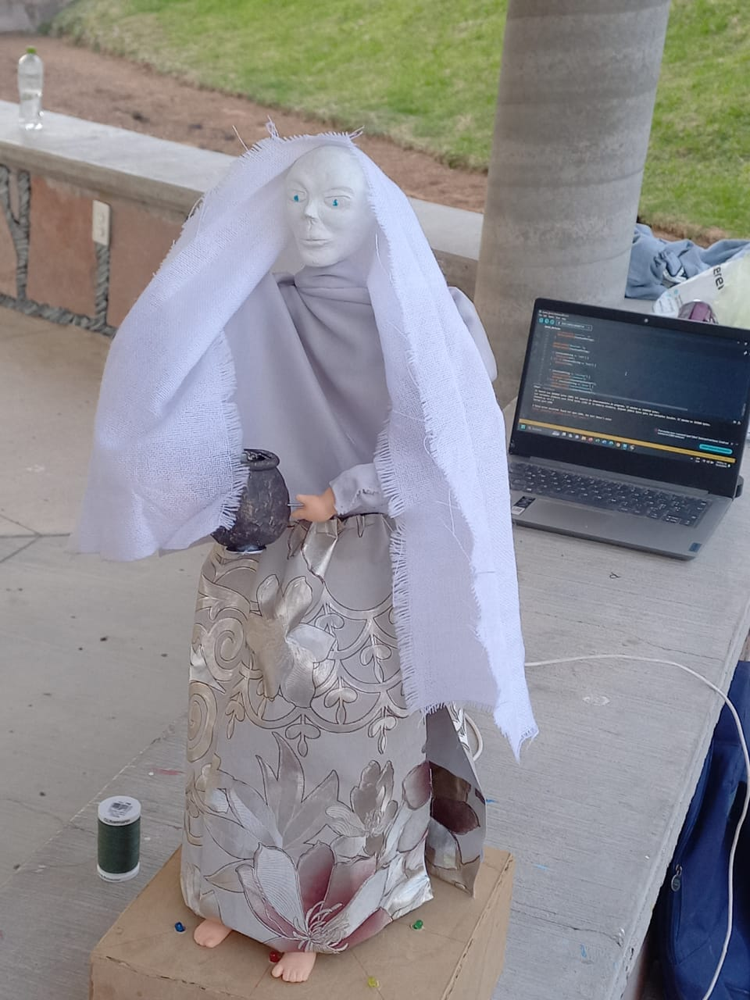
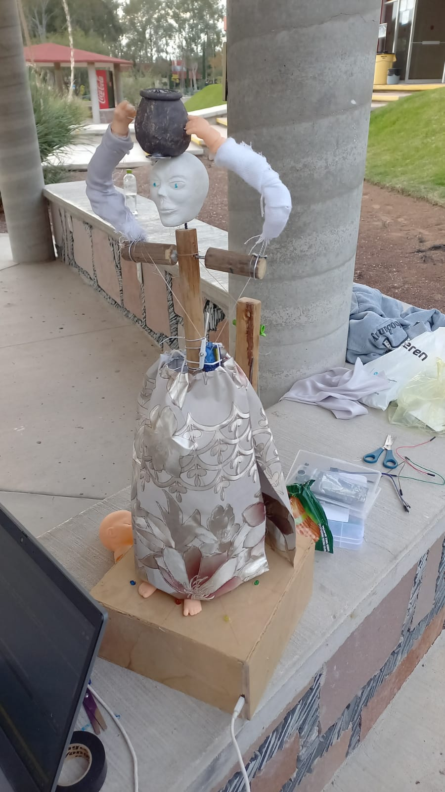
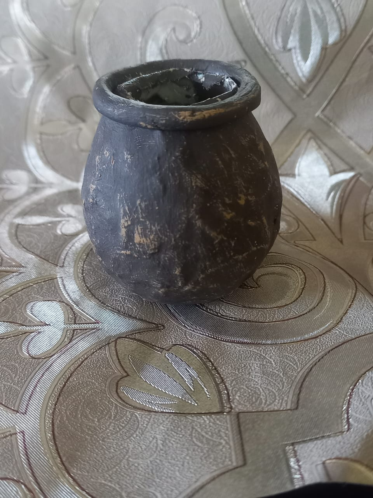
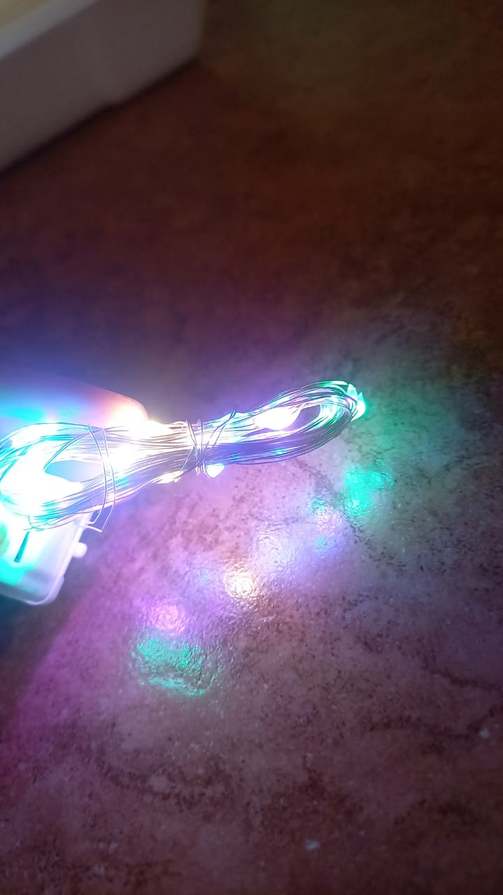
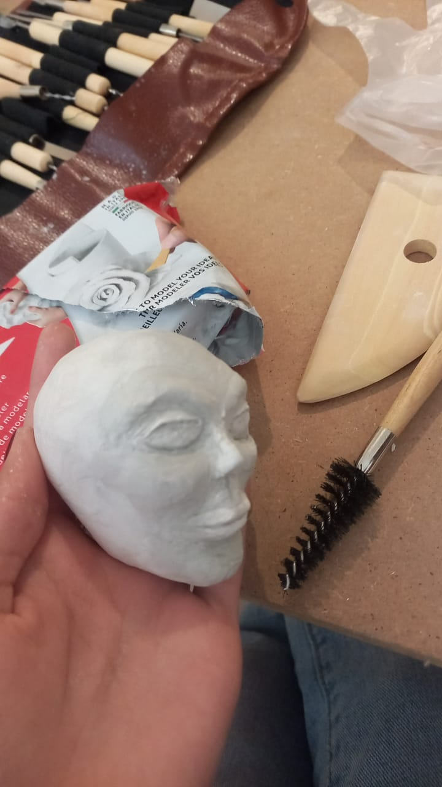

Carol_y_Diego
## Rebeca con cantaro 
## Materiales utilizados 

| Nombre del Componente | Descripción                   | Cantidad      | Precio (en pesos mexicanos) |
| ---------------------- | ------------------------------ | ------------- | -------------------------- |
| ESP32                  | Microcontrolador ESP32         | 1             | [$140]                     |
| LEDs RGB               | LEDs de colores para iluminar  | indefinido    | [$69 por 100 leds]          |
| Buzzer                 | Buzzer para reproducción de sonidos | 1          | [$69]                      |
| Servo Motor            | Servo motor para el movimiento | 1             | [$131 por 5 piezas]         |
| Material para la figura| Materiales para construir la figura de Rebeca | - | [$80]                      |
| Batería recargable     | Batería para alimentar el proyecto | 1           | [no definido]               |
| Cables y conectores    | Cables y conectores para la conexión | indefinido | [$39 por 40 cables Dupont o similares] |
## software utilizado
| Nombre del Software  | Versión   | Tipo             |
| -------------------- | --------- | ---------------- |
| Visual Studio Code   | 1.82.2    | Editor de código |
## Dibujo del prototipo a desarrollar

## Protocolo de comunicacion
| Protocolo  | Descripción                                                                                           |
| ---------- | ----------------------------------------------------------------------------------------------------- |
| Bluetooth  | El ESP32 es compatible con Bluetooth, lo que permite la comunicación inalámbrica con otros dispositivos Bluetooth, como sensores, teléfonos móviles y otros módulos ESP32. Esto es útil para proyectos que involucran comunicación cercana y de corto alcance. |

## Arquitectura

## Base de datos 

## Circuito en wokwi

##  Dibujo mejorado del prototipo

## Lista de materiales

| Producto                     | Descripción                | Precio |
|------------------------------|----------------------------|--------|
| Micro sevomotor              | Torque de 1.8kgf.cm        | $100    |
| Juego de 120 cables Dupont   | Longitud de 20cm           | $99    |
| Módulo buzzer pasivo         |                            | $29    |
| 4 LEDs                       |                            | $20    |
| Serie de luces LED           | Varios colores, 5 metros   | 20    |
| ESP32                        | Módulo de desarrollo       | $358    |
| Silicona                      | Tubo de 100ml              | $12    |
| Tela de dos tipos            | 1 metro cada tipo          | $60    |
| Tijeras                      | Para cortar materiales     | $10    |
| Arcilla                      | Paquete de modelado        | $8     |
| Unicel                       | Planchas de 30x30cm        | $5     |
| Papel aluminio               | Rollo de 5 metros          | $20     |
| Herramientas de modelado     | Set variado de modelado    | $25    |
| Hilos de plástico            | Variados colores           | $15    |
| Cinta                        | Rollo de 10 metros         | $4     |
| Sensor de proximidad         | Modelo detecta hasta 30cm  | $15    |
| Enguado                       | 500ml                      | $6     |
| Periódico                    | Paquete de hojas           | $3     |
| Estambre                     | Madejas variadas           | $9     |
| Plumones                     | Plumoneas de colores         | $12    |
| Madera                       | Tablas variadas            | $20    |
| Palo de escoba               | Madera, longitud estándar  | $5     |
| Cepillo                      | Para pintura               | $10     |
| Clavos                       | Caja surtida               | $8     |
| Alambre galvanizado          | Rollo de 20 metros         | $150    |
| Algodón                      | Bolsa de bolas             | $20     |
| Pistola de silicona          | Incluye 4 barras           | $20    |
| Hilo y aguja                 | Paquete de costura         | $5     |
| Manos y pies de plástico      | Modelo para proyectos      | $0    |

##  Lista de software.
utilizaremos varias herramientas de software en nuestro proyecto de IoT. Para controlar y gestionar componentes específicos, hemos decidido utilizar Arduino. Esta plataforma de hardware y su IDE asociado son ideales para programar microcontroladores y nos permitirán llevar a cabo las tareas necesarias para X en nuestro proyecto.

Además, para la programación en Python, hemos optado por Thonny, un entorno de desarrollo integrado (IDE) diseñado para programadores principiantes. Thonny simplificará la escritura y prueba de código en Python, lo cual es crucial para el control y monitoreo de nuestros dispositivos IoT. La inclusión de un depurador integrado también facilitará la resolución de problemas.

Para la fase final de nuestro proyecto y para la gestión más amplia de todos los componentes IoT, planeamos aprovechar PlatformIO. Esta plataforma de desarrollo de código abierto es muy versátil y compatible con diversas placas de desarrollo, incluyendo Arduino. Nos permitirá gestionar bibliotecas y entornos de desarrollo de manera eficiente, además de integrarse con servicios en la nube, lo que será fundamental para nuestra aplicación.

##  Imagenes de prueba

## Videos

